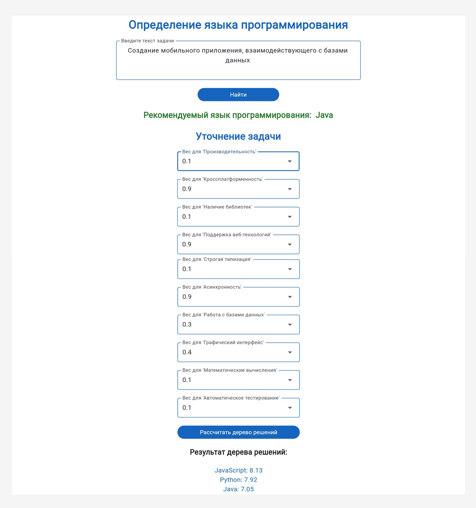

## Система рекомендации языков программирования с использованием деревьев решений и NLP

### Задача
Рекомендательная система для помощи в выборе оптимального языка программирования для конкретной задачи. Реализованы два взаимодополняющих подхода: дерево принятия решений и анализ текстового описания задачи.

### Стек технологий
- **Интерфейс**: Flet (кроссплатформенный фреймворк)
- **ML**: Random Forest + TF-IDF 
- **NLP**: Natasha (для русского языка)

## Функциональность

### 1. Дерево решений
- Пользователь оценивает важность критериев для решаемой задачи (Производительность, кроссплатформенность и т.д.).
- На основе взвешенных оценок система рекомендует оптимальный язык программирования.

### 2. NLP-анализ
- Пользователь описывает задачу естественным языком. 
- Обрабатка русского текста (токенизация, лемматизация)
- Преобразование текста в числовые признаки (TF-IDF)
- Классификация задачи с помощью Random Forest
- Рекомендация подходящего языка программирования

## Запуск
```bash
# Установка зависимостей
pip install -r requirements.txt
# Запуск  
python src/gui_flet.py
# Приложение откроется в браузере по адресу http://localhost:8000
```




